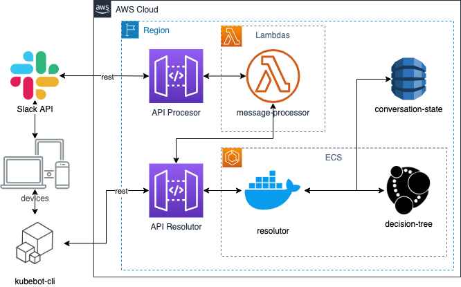

# spike-kubebot-faq
Kubebot-faq es un bot que ayuda a entender y resolver problemas con despliegues en kubernetes. Es un spike para explorar el potencial de la herramienta Neo4j con base de datos de conocimiento.

## Contenido

- [1. Introducción](#1-introducción)
- [2. Instalación](#2-instalación)
- [3. Arquitectura](#3-arquitectura)
  - [3.1 Atributos de calidad](#3-1-atributos-de-calidad)
  - [3.2 Vista lógica](#3-2-vista-lógica)
  - [3.3 Vista de proceso](#3-3-vista-de-proceso)
  - [3.4 Vista de desarrollo](#3-4-vista-de-desarrollo)
  - [3.5 Vista física](#3-5-vista-física)
  - [3.6 Vista de escenearios](#3-6-vista-de-escenarios)
  - [3.7 Evaluación arquitectura con ATAM](#3-7-evaluación-arquitectura-con-atam)
- [4. Conclusión](#4-conclusión)
- [5. Fuentes](#5-fuentes)


## 1. Introducción

TODO: introducción
Responder a las preguntas: 

- ¿Por que surge la idea?
- ¿Qué problema resuelve?
- ¿Por qué es importante resolverlo?
- ¿Qué causa el problema?
- ¿Qué consecuencias tiene?


## 2. Instalación

### 2.1 Creación aplicación en Slack

### 2.2 Ejecución en ambiente local

Una vez clonado el proyecto instale las dependencias:

```sh
npm install
```

Para ejecutar las pruebas automatizadas:
```sh
npm run test
````

Para ejecutar el lint (configurado con el estilo standard):

```sh
npm run lint
```

Se recomienda instalar _neo4j_ usando Docker:

TODO: crear un archivo docker-compose

```sh
docker run -p7474:7474 -p7687:7687 -e NEO4J_AUTH=neo4j/s3cr3t neo4j
````

Para hacer las pruebas remotas con la API de Slack, se usa ngrok, si no lo tiene instalado, lo puede instalar usando el siguiente comando:

```sh
npm install -g ngrok
```

## 3. Arquitectura 

### 3.1 Atributos de calidad

- TODO: listar los *ality mas importantes para este producto.

### 3.2 Vista lógica
- diagrama de clases


- diagrama de estado


- Modelo de datos (Grafo de conocimiento)


### 3.3 Vista de proceso
- diagrama de secuencia


- diagrama de comunicación


### 3.4 Vista de desarrollo
- diagrama de componentes



### 3.5 Vista física
- diagrama de despliegue asociado a terraform.


### 3.6 Vista de escenarios
- casos de uso


- user journy map

### 3.7 Evaluación arquitectura con ATAM

Hacer un pequeño analisis de atam, responder con los patrones:
- Serverless en AWS (well architected framework) con nodejs (escalabilidad) modelo de concurrencia (basado en eventos)
- Base de datos NoSQL tipo grafos, que ventajas da, que se pierde

## 4. Conclusión

TODO: que aporta este spike a la comunidad.

## 5. Fuentes
